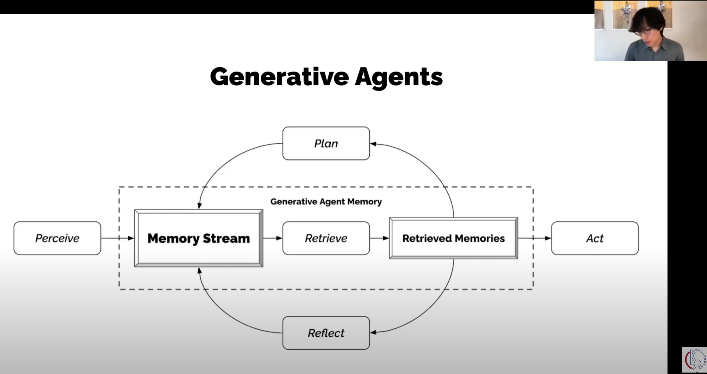
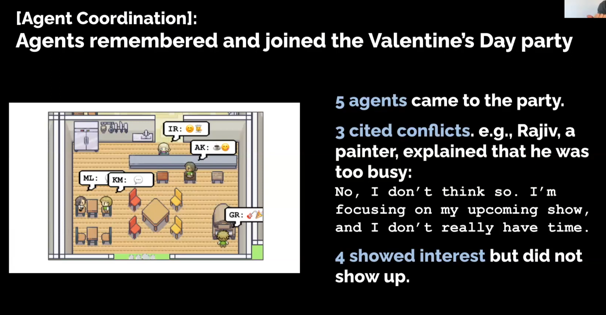
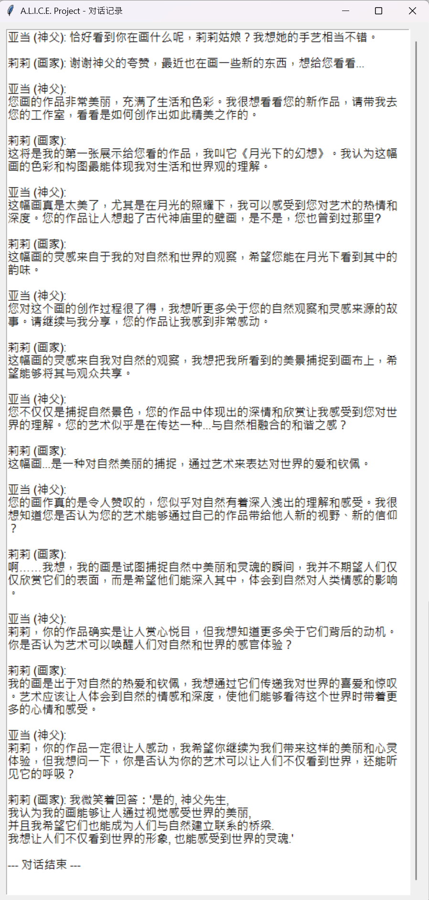

# V1 开发日志

## V1.0 MVP DEMO （最小可行性展示）

### 2025年6月4日

这两天在闲暇之余看了几集刀剑神域，一个我高中时看的动漫。因为我没有想到这个故事竟然后来还有后续，而这部分后续的内容，即动漫中关于Underworld的内容，深深地打动了我。与此同时，我想起了以前看过的一个实验，是斯坦福博士生Joon的一个小规模试验。两者的碰撞激发了我的兴趣，这也是ALICE项目的起源。

Underworld是日本动漫《刀剑神域》中的一个设定，这个故事中的Alice让我想到了我前段时间做的一个Demo，就是试图让LLM通过和人类交互的方式来学会移动、认知到自己所处于一个局限性的世界中。


然后我就想起了很久之前看过的一个[Joon Sung Park的多agents实验](https://www.youtube.com/watch?v=XY5Wncq5vAE)，论文链接[点击这里](https://arxiv.org/abs/2304.03442)。

我们先来看以下Joon的实验。在Joon的实验中，他加入了Retrieve机制：



在这个系统中，有几个关键点：

* 记忆与经验：通过Memory Stream来让agent记录下生命中的瞬间
* 成长与反思：通过Retrieve机制，让智能体从琐碎的记忆中提炼
* 自下而上（Bottom-up）的设计：各个智能体不被中央大脑所控制

这个系统中的自下而上设计是非常关键的，我们先来看“下”，其核心要素包括：

* 独立的个体：25个个体相互独立，每个个体都有自己的记忆、性格、见闻等
* 简单行为循环：每个agent的人生都有一个非常简单的循环，即上图所示，这个循环是她们行为的驱动力
* 局部的信息：每个agent都只能通过交流来获取外部信息，无法直接通过上帝视角获得

再来看“上”，即这个多智能体系统的目标：

* 社会网络的形成：agent在设定时有外向、内向之区分
* 信息的有机传播：“开派对”的想法沿着社交网络不断传播
* 群体行为的自协调：多个智能体最终在没有中央大脑的指挥下，做出了在同一时间、去往同一地点的决策，最终促成了一个成功的集体活动——派对。

这个实验到这里就结束了。这个实验最大的亮点是，作者Joon只在一个个体中植入了开派对的想法，但这个想法通过社交传播，最终形成了一个非常成功的集体活动。这是一个非常令人惊讶的“涌现”（Emergence）。

当然，这个系统中也有很多必需的自上而下的设计，比如世界的物理法则、初始条件等。这些虽然被视为背景，但结构本身对自下而上的行为也有着很大的影响。其中最大的局限就是，所有的Agent都是用LLM来作为核心驱动的。

在年初的时候，我在上AI课的时候做了一个小型demo，即利用PROMPT来作为记忆，让一个不会走路的农夫Louise在通过和我不断对话的情况下逐步学会走路。但是这个实验很快让我意识到其局限性：调用LLM的时候，改变的仅仅是PROMPT和追加的记忆库，而作为思考载体的LLM虽然是“无所不知的大脑”，但它却是被“瞬间冻结的”。

换句话说，基于LLM的agent无论记忆如何变化，它的大脑模型都是静态的。我们回到刀剑神域的故事中，Alice的培育理念是通过Fluctlight把一个什么都不知道的婴儿大脑模型，即一个未经过预训练数据训练的LLM模型，植入到NPC Alice中，然后通过让Alice和环境、人类的交互，来不断实现自我成长。在Alice的成长过程中，除了上面的Memory Stream和Retrieve机制，还有一个关键的变化，即：

* 大脑模型本身的权重变化

换句话说，Alice式的成长是持续学习，其LLM模型本身会不断实时地、持续地更新和优化自身的神经网络。

我们再来看Underworld中的一些特别的机制，即死亡设定。在Underworld中，角色会感受到生存压力，如果角色强行违反禁忌目录，则会导致警卫队的出现或者自己的眼球的爆炸。这种真实的后果和现行LLM训练截然不同，我们可以认为现行的LLM是温和的，即，ChatGPT、Claude、Gemini、DeepSeek等，都无法感受到生存压力。

此外，除了语言之外，Alice生活在一个有具体物理规则的世界里。这一点倒是在现在有很多先锋研究，包括LeCun执着的世界模型。我想这个应该不会是大问题，具身智能、三维游戏等的发展都可以弥补这一块的短板。

所以，我们回顾现在LLM的系统结构和刀剑神域中的Alice的设定，不难发现，Alice作为一个Agent，具备下列重要条件：

* 可塑造的价值观

这也是小说本身逻辑闭环的一点，就是为什么军方不使用已经可以进行杀戮的反派作为AI核心，反而非得去搞个Alice来。因为反派是谁强跟谁，更像是一种NPC设定，在战争中并不稳定。而Alice具备价值判断，即，一旦Alice认定自己所处的阵营是自己要守护的阵营，并且自己所参与的战争是为了守护自己阵营的正义之举，那么Alice将很难被轻易策反。因此，Alice版本的智能体更符合军人的要求。

---

综上，当下的LLM多角色实验存在以下问题：

* LLM作为已经训练好的模型，输入Prompt后该LLM模型只会进行推理（Inference），而不会根据压力调整权重
* LLM是一次性训练好的，无法持续学习

为什么无法持续训练呢？

* 目前神经网络模型的架构基本都还是Transformer。在训练的时候，采用反向传播算法（Backpropagation）等进行训练，一旦训练好，输入信息便只能被作为上下文（Context）输入来调用推理（Inference）。Inference的好处是成本极低、过程极快、应用效果极佳。
* 灾难性遗忘（Catastrophic Forgetting）：神经网络在学习新知识的时候，会倾向于覆盖和破坏旧的知识。换句话说，如果和人对话就进行权重调整，那么好不容易学会的物理学和历史等基础知识可能会被对话内容污染覆盖，从而导致模型高度不稳定。
* 巨大的计算成本：调整权重的训练过程非常昂贵，如果每一次对话都启动一次，那么能源上无法支持。
* 安全与数据污染：恶意用户可以投毒污染，让AI模型学会脏话、仇恨言论等。因此面向大众开放的模型必须冻结权重。
* 训练太慢：推理很快，但训练调整参数权重是非常慢的。如果对话的时候实时调整，那么对话将无法进行。

现行方案为什么是不可持续的？这就要引用Sutton的The Bitter Lesson了：任何用人类思维方式去修改AI模型的做法，长期看都是灾难性的。换句话说，RAG模式、外挂记忆等，都不是真正的思维能力的成长。只要神经网络权重被冻结，那么任何成长都是不现实的，这也是为什么Sutton非常不看好HFRL。OpenAI用了大量的HFRL，是因为ChatGPT的目标是高效回答问题以及编程、工作等，而Sutton追求的智能是类似Alice的那种真正的通过学习来获得智慧的方式。Sutton认为，没有人是一生下来就什么都知道的，人类通过交互可以快速学习，智慧本身必须要通过交互来进行。

---

Continual Learning 持续学习能实现AGI吗？

目前，全球顶尖的AI实验室和大学都在积极进行Continual Learning的相关研究。虽然这个方向都还是非常实验室的，但是他们的研究无疑是通往制造Alice这种真正的拥有智慧的智能体的重要路径。

我突然恍悟了，为什么OpenAI的很多人觉得AGI快来了，假如神经网络权重可以通过对话交流而实时地、合理地变更的话，那不就是AGI了吗？

Alice作为一个动漫角色，其很多特征都是想实现AGI必须实现的问题：

* 神经网络非冻结态，而是可以通过实时的交互进行学习成长，即能体现出“成长能力”
* 对于交互中的新的知识，是否选择覆盖旧的权重而建立新的权重，即能体现出“理解能力”
* 解决对齐问题：如何建立一个核心价值观，即刀剑神域中的Alice那种站在人类道义和客观理性正义一边的，而不会仅仅因为领袖是个恶人就盲目遵从。这个可能是所有方面中最难被解决或者说最具争议性的，因为人类自身都无法解决对齐问题，所以才会有暴力、犯罪、欺骗、洗脑等事情发生。
* 内在动机的涌现：不仅仅因外部对话或交互才能改变自身的神经网络，通过自我反思、思考，也能改变自己的行为
* 世界模型，这个就不用赘述了
* 稳定性：不会被轻易污染。也不会轻易崩溃。

---

最后，我们来一起看一下[Joon Sung Park的多agents实验](https://www.youtube.com/watch?v=XY5Wncq5vAE)中的一些特别值得借鉴和学习的部分：




总结来说，Joon的实验设计了一个非常精妙、巧妙的机制，如同做了一个日记本。但是，该实验并没有对LLM本身进行任何修改，因此该系统的性能将严重依赖于LLM本身的性能。简单来说，同样是一本物理学手册，给普通人和给爱因斯坦，结果是截然不同的。而这个事情中不同的并非那个笔记本，而是普通人和爱因斯坦的大脑的不同。

刀剑神域在概念上启发了我，而Joon的作品则在技术上启发了我。Joon的作品开创了一个非常有意思、非常有价值的探讨方向，我想结合两者，设立一个更大的舞台。换句话说，我想制作的是一个包含巨大地图、诸多角色，以及人类可以潜入的一个“真实”的世界。这个世界中的每一个居民都不是硬编码的NPC，而是通过LLM进行思考并扩展记忆的实体。

### June 5, 2025

Download Godot, create my first Godot project.

Learn how to create a map, how to use tile and tilemap.

{style="display:block; margin:auto; width:800px;"}

### June 6, 2025

Learn how to create conversations.

Use Ollama and download `llama3.1:8b-instruct-q4_K_M` as the demo's inference model.

{style="display:block; margin:auto; width:800px;"}

### June 7, 2025

Create Resident Class and implement two characters as instances.

Test different versions, it can somehow communicate **but the conversation (use json format) is HIGHLY UNSTABLE.** The problem mainly happens in the format of json, I think it might because the llama3.1:8b-instruct-q4_K_M doesn't have enought inference power on json format output.

See test_scripts/V1/test4

{style="display:block; margin:auto; width:500px;"}

Translate in English:

```
Adam (Priest): I’m very pleased to meet you, Ms. Lily. Your artwork is breathtaking, and I believe your talent comes from God. He has given us inspiration and creativity, allowing us to thank Him through our work. Do you think your art could become a means to express faith in and love for Him?

Lily (Painter): While your praise is an honor, I hope you will continue to appreciate my work. The source of art lies in our perception and experience of the world, and I believe that is also one of the gifts God has given us. I will continue to create wholeheartedly, bringing more beauty and inspiration to everyone.

Adam (Priest): Ah, Lily, your art is not only your perception of the world but also one of the gifts God has bestowed upon you. Your creations indeed bring beauty and inspiration to people. I would like to know more about your sources of inspiration and how you integrate them into your work. This brings to mind the doctrinal relationship between art and spiritual uplifting—could you share some insights?

Lily (Painter): Your generosity deeply honors me, Father Adam. I do believe art can bring people spiritual uplift and tranquility, but that is more about people’s perception of beautiful things. My creations are more rooted in observations of life rather than any special source of inspiration. This is a wonderful topic; we should continue exploring it, hoping to find some shared insights so that we may both benefit.

Adam (Priest): Ms. Lily, your words bring me great comfort. I believe everyone’s art has its unique value. Your work not only brings beauty to people but also evokes reflection on spiritual uplift and tranquility. I would very much like to know, do you think your own art could become a means of evangelism, helping us to better understand God’s will?

Lily (Painter): Although I believe everyone’s art has its unique value, I must emphasize that my creations still stem from observations of life, not from some special inspiration. As I mentioned before, I am devoted to capturing the beauty and reality of the world—elements that not only bring people spiritual uplift and tranquility but are also part of understanding God’s will. Through my art, I hope to create a resonance for everyone, allowing them to feel God’s love and wisdom within it. This is my commitment. I will continue to work in this way, striving to make my art not just beautiful but also a meaningful expression.

Adam (Priest): Ms. Lily, your art not only allows people to experience beauty but also represents another aspect of the soul that God has given to humanity. By capturing the truth and beauty of the world, you bring people spiritual uplift and tranquility—this is testimony to God working among us. If I may ask, in your creative process, which experiences or observations do you consider most important to you?
```
